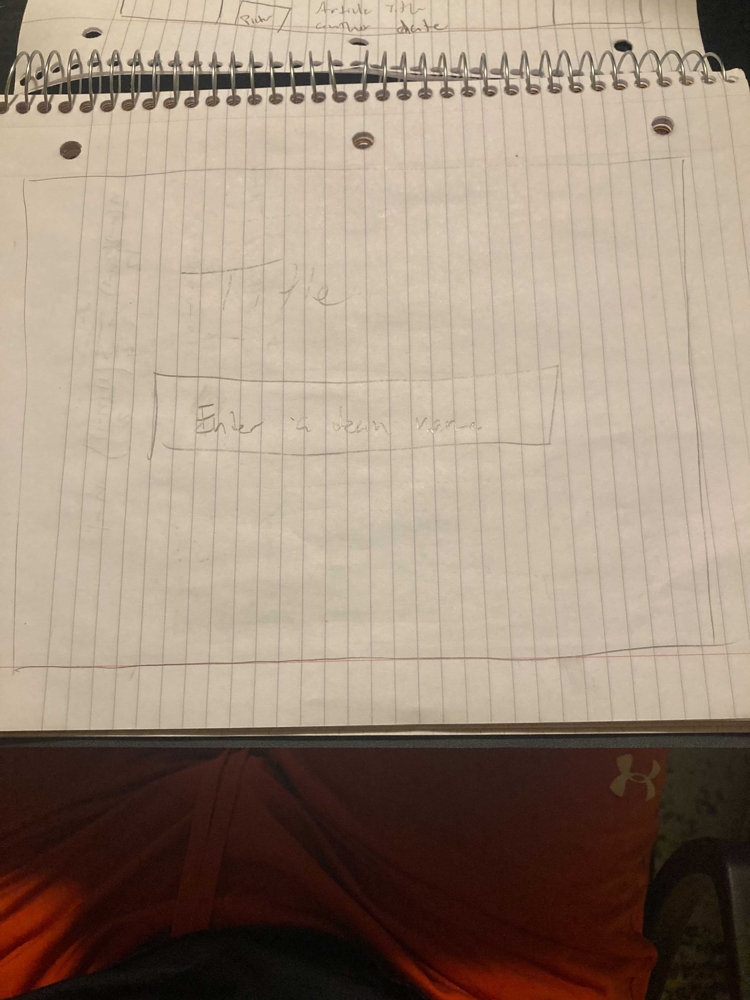
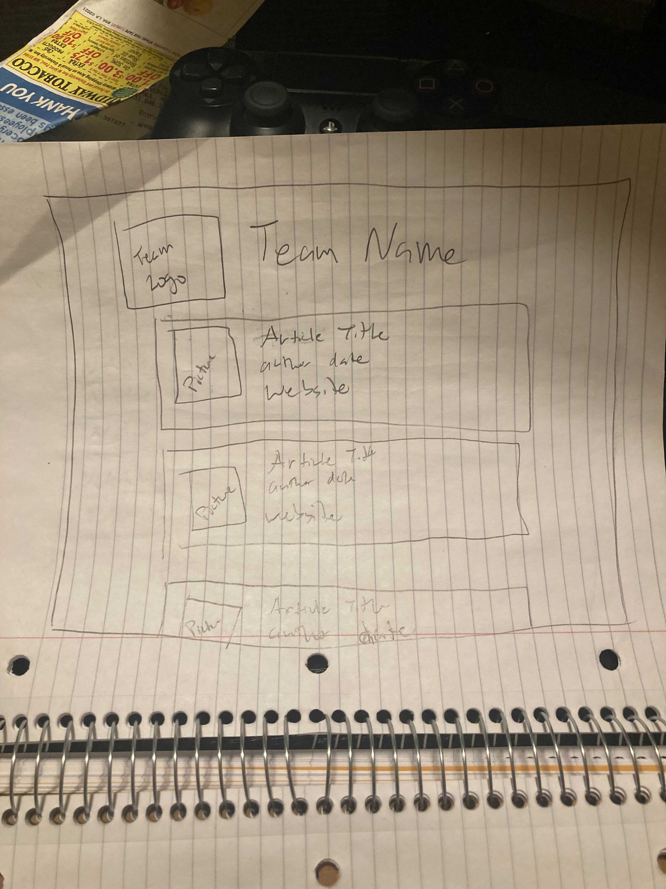
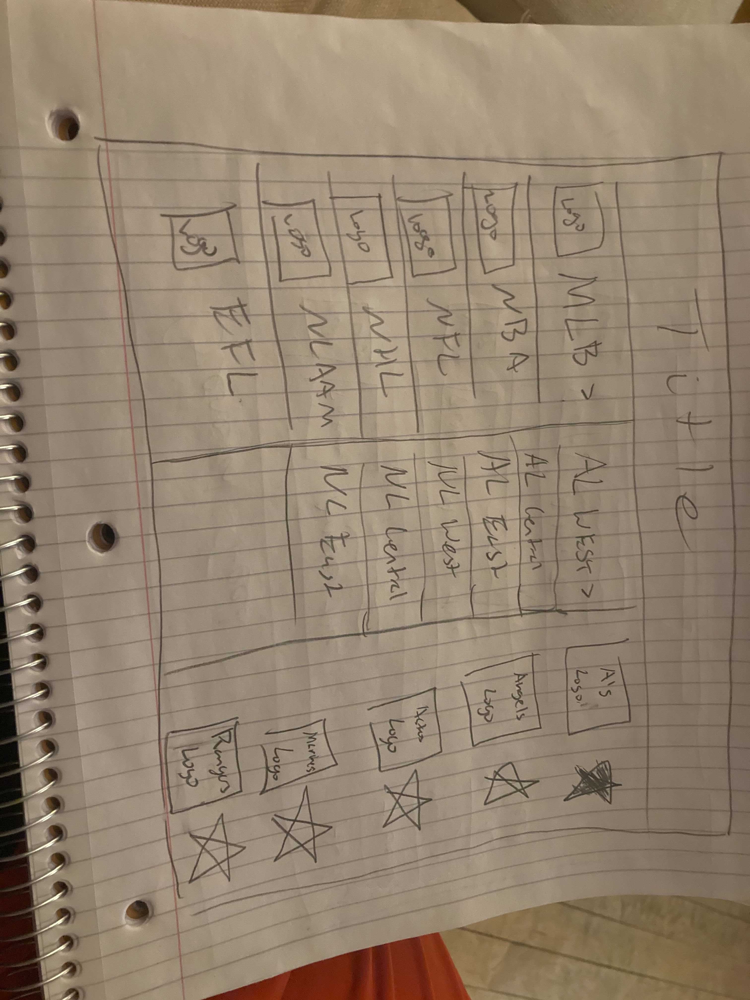
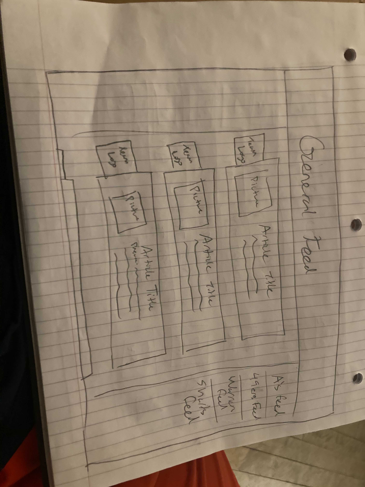
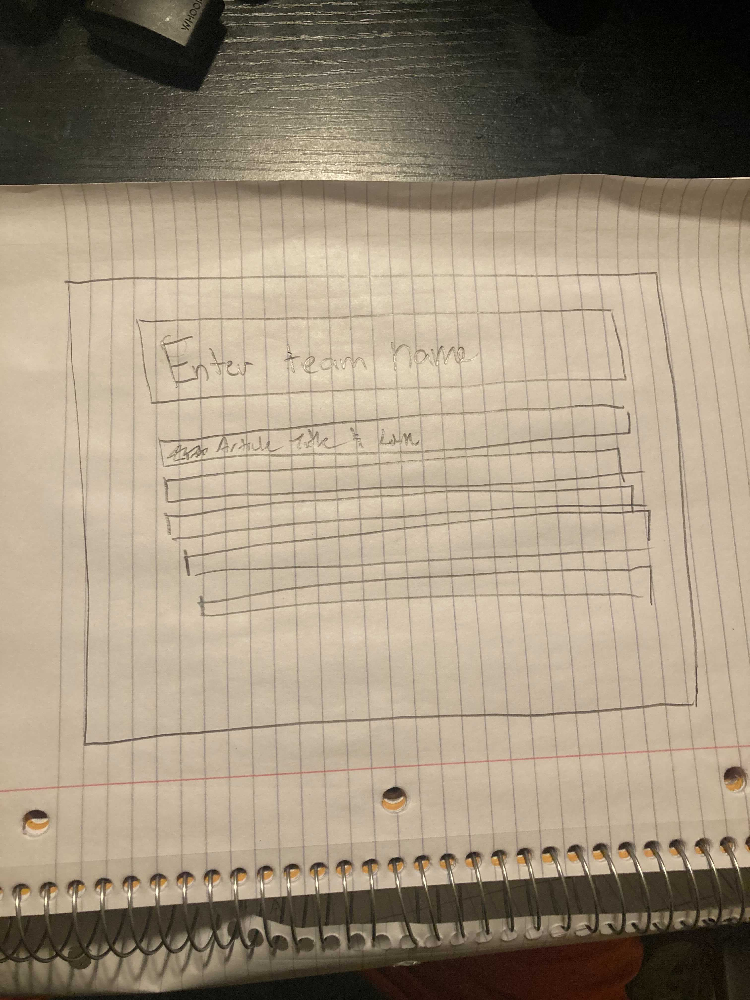
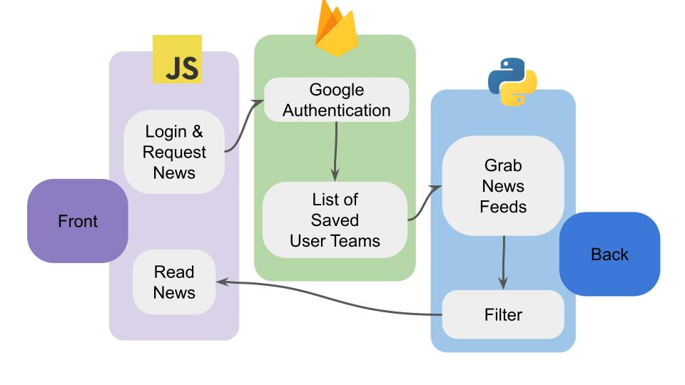

COMP 225 Project - tympdeja
======================================================

### Product Vision:
* To make it easier to get articles about a sports team(s) in one place
* It allows fans to have their news in a single place
* It will present links to certain articles based on preferences for a certain sports team
### Audience: 
* Sports fans
* Release unknown
### Risks:
* Not knowing how to scrape articles onto the webpage
* Difficult to get access to certain APIs
* We don’t know what languages we are going to use

## Basic Design

### Search bar
* User can enter a team name
* Send it to google and search for the team with news added to the end
* Scrapes the 5 most recent articles

### Display
* Title of article
* When it was written
* First sentence of the article
* Where its from

## Advanced Features

### Search bar
* Keep the search bar but add features where u can have multiple teams
* Settings Tab
* Change the language that its in

### Display
* Shows a preview of the article
* General feed
* Individual team display

### Important Links

* Template Forest
[Link to Templates](https://themeforest.net/category/site-templates/admin-templates)

### Paper Mock Ups

### System

